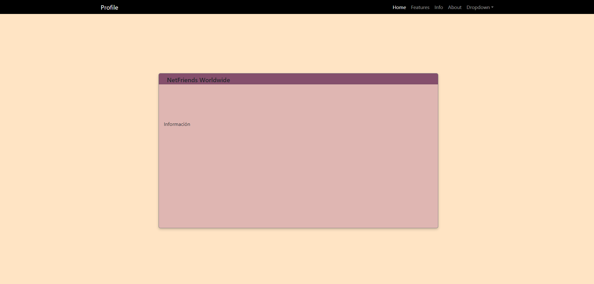

# Profile and Magazine Project

This project is about creating a personal profile to fill in information about yourself as a mini biography of yourself and also add a magazine about it, it could be your favorite day or weather and expand on that.

The idea is to implement HTML/CSS with the Bootstrap framework and not necessarily use UX/UI but make the project as creative as possible. I used Git to create the repository and github to store my progress alike.

I'm focusing on working on my github with the details of the progress so I can have a clear handle on everything it covers.

The truth is that the goal is to make it as presentable and aesthetic as possible, it would be my greatest achievement.

**1st day in #30NitesOfCode🥚 today I learned/advanced:**

- Create the project idea about a profile and a magazine using HTML/CSS along with Boostrap and JavaScript 🎯
- Prepare the concept of what I want to implement in the project 💡
- Watch 1 video on how to use Git 💻
- Create the repository using Git/Github 🧵
- Create the frame of the web page design 🎀

**2nd day in #30NitesOfCode🥚 today I learned/advanced:**

- Watch video on how to use Bootstrap in HTML 🎯
- Add the framework to the project 🎲
- Review git and github documentation ⚙
- Review Markdown documentation 🎫
- Watch video how to make a website with html css and bootstrap 5 🎞

**3rd day in #30NitesOfCode🥚 today I learned/advanced:**

- Find information on how to make some page adjustments with bootstrap🌼
- Watch video detailing the use of Bootstrap in the code👗
- Update commits in terminal🎈
- Start with code preparation✨
- Add a box for personal profile and a browser🩰
- Search the bootstrap library for models to follow the code🍂

This is how the first steps of the page remain today 03/01/24 is that I began to give it structure and a little style.

